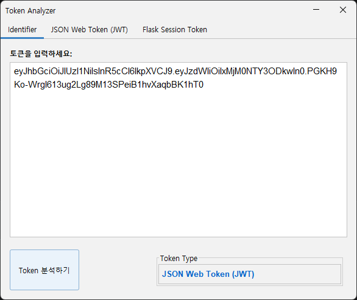
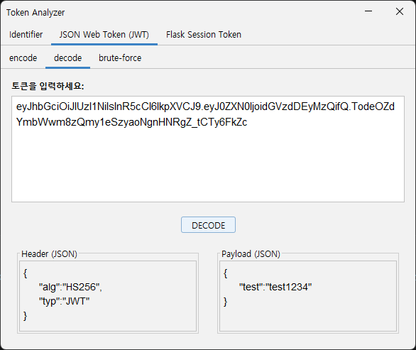
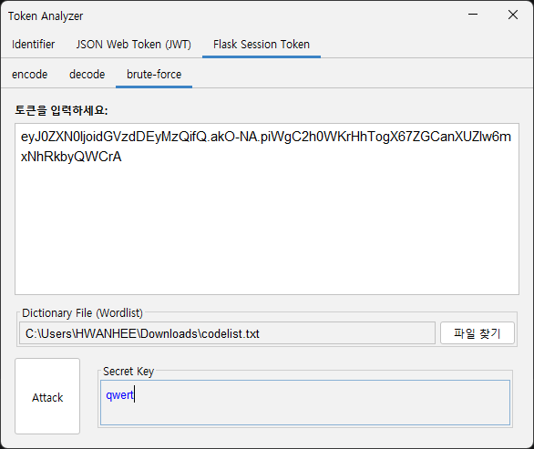
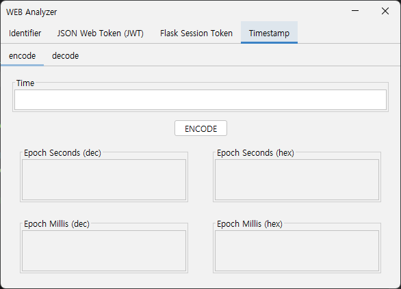

# Token Analyzer

> **JWT**와 **Flask Session Token**을 분석, 디코딩, 인코딩, 브루트포스하고, Unix 타임스탬프를 변환할 수 있는 Java Swing 데스크톱 애플리케이션입니다.

[English](README.md)

---

## 주요 기능

- **토큰 식별기** — 입력한 토큰이 JWT인지, Flask Session Token인지, 혹은 알 수 없는 형식인지 자동 판별
- **JWT (JSON Web Token)**
  - 헤더 및 페이로드 디코딩
  - 커스텀 헤더·페이로드·시크릿으로 새 토큰 생성
  - 워드리스트 파일을 이용한 서명 시크릿 브루트포스
- **Flask Session Token**
  - 페이로드 및 타임스탬프 디코딩
  - 커스텀 페이로드·시크릿으로 새 토큰 생성
  - 워드리스트 파일을 이용한 서명 시크릿 브루트포스
- **Timestamp**
  - 날짜/시간 문자열을 Unix 타임스탬프(초·밀리초, 10진수·16진수)로 인코딩
  - Unix 타임스탬프(10진수 또는 `0x`가 붙은 16진수)를 원하는 타임존(UTC, Asia/Seoul 등)의 날짜/시간으로 디코딩

## 기술 스택

| 개요 | 기술 |
|---|---|
| 언어 | Java |
| UI 프레임워크 | Java Swing |
| UI 테마 | [FlatLaf](https://github.com/JFormDesigner/FlatLaf) 3.6 |
| 암호화 | HMAC-SHA256 (javax.crypto), Base64 URL 인코딩 |
| 스트림 처리 | 브루트포스에 Parallel Stream 사용 |

## 실행 방법

[Releases 페이지](https://github.com/jonber2185/TokenAnalyzer/releases)에서 최신 버전을 다운로드하세요.

### 방법 1 — Windows EXE (ZIP)

1. 릴리즈에서 `TokenAnalyzer.zip`을 다운로드합니다.
2. **ZIP 파일을 폴더째로 압축 해제**합니다. `.exe`
3. 압축 해제된 폴더 안의 `TokenAnalyzer.exe`를 실행합니다.
<br>※ 파일만 단독으로 옮기면 실행되지 않습니다. 런타임, 앱 폴더가 함께 있어야 합니다.

### 방법 2 — JAR (Java 필요)

```bash
java -jar TokenAnalyzer.jar
```

### 방법 3 — 소스에서 실행 (Eclipse)

1. Eclipse에서 기존 Java 프로젝트로 임포트합니다.
2. `lib/flatlaf-3.6.jar`가 빌드 패스에 추가되어 있는지 확인합니다.
3. `Main.java`를 실행합니다.

## 스크린샷

### Identifier 탭



### JWT 탭



### Flask Session Token 탭



### Timestamp 탭



## 사용법

### Identifier 탭

입력란에 토큰을 붙여넣고 **Identify** 버튼을 클릭하면 토큰 유형이 표시됩니다.

### JWT 탭

| 탭 | 설명 |
|---|---|
| Decode | JWT를 붙여넣어 헤더와 페이로드를 디코딩 |
| Encode | 헤더 JSON, 페이로드 JSON, 시크릿을 입력해 새 JWT 생성 |
| Brute Force | JWT와 워드리스트 파일 경로를 입력해 서명 시크릿 탐색 |

### Flask Session Token 탭

| 탭 | 설명 |
|---|---|
| Decode | Flask 세션 토큰을 붙여넣어 페이로드와 생성 시각을 디코딩 |
| Encode | 페이로드 JSON과 시크릿을 입력해 새 Flask 세션 토큰 생성 |
| Brute Force | 토큰과 워드리스트 파일 경로를 입력해 서명 시크릿 탐색 |

### Timestamp 탭

| 탭 | 설명 |
|---|---|
| Encode | 날짜/시간 문자열(예: `2026-07-27T17:04:39.463Z`)을 입력하면 초/밀리초 단위 Unix 타임스탬프를 10진수·16진수로 표시 |
| Decode | Unix 타임스탬프(10진수 또는 `0x`가 붙은 16진수)를 입력하고 타임존을 선택하면 해당 날짜/시간을 표시 |

## 토큰 형식

**JWT:** `<Base64URL(헤더)>.<Base64URL(페이로드)>.<HMAC-SHA256 서명>`

**Flask Session Token:** `<Base64URL(페이로드)>.<Base64URL(타임스탬프)>.<HMAC-SHA256 서명>`

## 주의
- 이 도구는 **보안 테스트 및 교육 목적**으로만 사용해야 합니다.